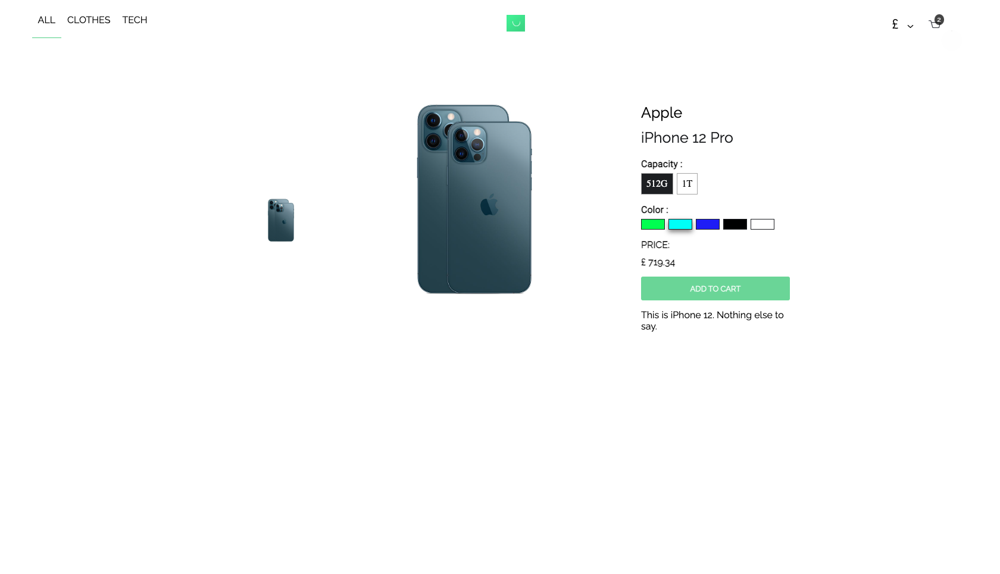

  <h1><b>Scandiweb Junior React Developer test assignment</b></h1>

<!-- TABLE OF CONTENTS -->

## 📗 Table of Contents

- [📖 About the Project](#about-project)
  - [🛠 Built With](#built-with)
    - [Tech Stack](#tech-stack)
    - [Key Features](#key-features)
  - [🚀 Live Demo](#live-demo)
- [💻 Getting Started](#getting-started)
  - [Setup](#setup)
  - [Prerequisites](#prerequisites)
  - [Install](#install)
  - [Usage](#usage)
  - [Run tests](#run-tests)
  - [Deployment](#triangular_flag_on_post-deployment)
- [👥 Authors](#authors)
- [🔭 Future Features](#future-features)
- [🤝 Contributing](#contributing)
- [⭐️ Show your support](#support)
- [🙏 Acknowledgements](#acknowledgements)
- [❓ FAQ (OPTIONAL)](#faq)
- [📝 License](#license)

<!-- PROJECT DESCRIPTION -->

## 📖 Ecommerce web app

  <h3></h3>
  <h3></h3>

* This ecommerce app is a web app for shopping. 
* Add products or remove products. 
* Increase/decrease count of a particular selected product.
* Select various attributes (color, size etc) for each product.
* Converts total amount of products to reflect the current currency. No Api

## 🛠 Built With 

* Project was built with React class component. No functional component used.

### Tech Stack 

  
Client

  <ul>
    <li><a href="https://reactjs.org/">React.js</a></li>
    <li><a href="https://redux.js.org/">Redux</a></li>
    <li><a href="https://redux.js.org/">Javascript</a></li>
    <li><a href="https://redux.js.org/">styled Components</a></li>
  </ul>

  
Server

  <ul>
    <li><a href="https://www.apollographql.com/docs/react/">Apollo GraphQl</a></li>
  </ul>

Database/ storage

  <li>Browser's Local Storage</li>

<!-- Features -->

### Key Features 

- *Data is persistent even if the browser is closed*
- *Built a customize drop down without the use of HTML "select" and "option" tag*
- *Redux was used to ensure that state changes is globally reflected instantly without refreshing the browser*
- *There is a dynamic url which has the id for each product that is selected*
- *Same product with different attributes selected is treated as new product using the unique products attributes selected*

(<a href="#readme-top">back to top</a>)

<!-- LIVE DEMO -->

## 🚀 Live Demo 

> Link cooming soon.

- [Live Demo Link](#)

(<a href="#readme-top">back to top</a>)

<!-- GETTING STARTED -->

## 💻 Getting Started 

To get a local copy up and running, follow these steps.

### Prerequisites

<!-- In order to run this project you need: -->

- *Install node packages. This can be achieved using npm install*
- *Computer with browser*
- *Mobile device with browser*

<!--
Example command:

sh
 gem install rails

 -->

### Setup

Clone this repository to your desired folder:

- cd your-local-folder
- clone this repository into your local directory
- open the project in your favorite code editor
- Install node packages 
- run npm start to preview in your local browser

### Install

Install this project with: npm install

### Usage

To run the project, execute the following command:

-*Start the server with: npm start or yarn start*

### Deployment

You can deploy this project using:

(<a href="#readme-top">back to top</a>)

<!-- AUTHORS -->

## 👥 Authors 

👤 *Author1*

Dennis Owusu Prah

- GitHub: [@til2to](https://github.com/til2to)

(<a href="#readme-top">back to top</a>)

<!-- FUTURE FEATURES -->

## 🔭 Future Features 

- [ ] *Add postgresql database*
- [ ] *Add payment methods*
- [ ] *Currently working to deploy it*

(<a href="#readme-top">back to top</a>)

<!-- CONTRIBUTING -->

## 🤠Contributing 

Contributions, issues, and feature requests are welcome!

Feel free to check the [issues page](../../issues/).

(<a href="#readme-top">back to top</a>)

<!-- SUPPORT -->

## ⭐️ Show your support 

If you like this project... thumbs up and please follow my github page

(<a href="#readme-top">back to top</a>)

<!-- ACKNOWLEDGEMENTS -->

## 🙠Acknowledgments 

- Hat tip to anyone whose code was used
- Hat tip to anyone who inspired my codebase

(<a href="#readme-top">back to top</a>)

<!-- FAQ (optional) -->

## ❓ FAQ (OPTIONAL) 

> Add at least 2 questions new developers would ask when they decide to use your project.

- *How was the browser's storage and redux used interchangeably*

  - Always be mindful of the return statement for the state in the redux like was followed in this project

- *Was someone else's code used*

  - No. Code wasn't copied. I believe algorithms and data structures are very powerful to handle greater things. 
  

(<a href="#readme-top">back to top</a>)

<!-- LICENSE -->

(<a href="#readme-top">back to top</a>)

## 📝 License

This project is [MIT](https://choosealicense.com/licenses/mit/) licensed.
